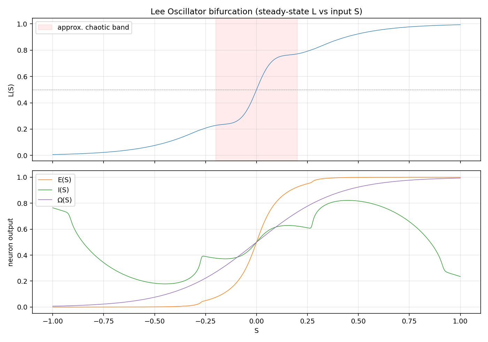
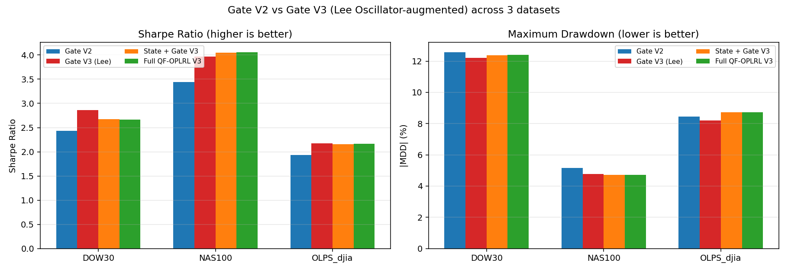
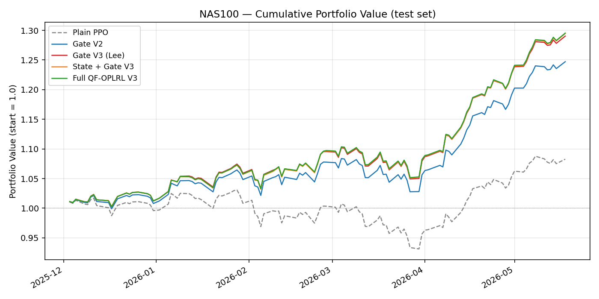

# Lee Oscillator Gate V3

This document describes Gate V3, a Lee-Oscillator-augmented refinement of Gate V2
introduced to bring the project closer to Dr. Raymond Lee's "Neural Oscillators"
research direction (one of the required AI technologies in the course project
requirements).

## Motivation

Gate V2 already lifts Sharpe and reduces MDD significantly across DOW30, NAS100,
and OLPS_djia. Its only direction-sensitive feature is the linear momentum
``compute_momentum(prices, window=5)`` (a 5-day percentage change). This signal
reacts identically in low-volatility noisy windows and in clean trending
windows.

Lee 2004's chaotic neural oscillator produces a transient-chaotic envelope
``exp(-k * S^2)`` that smoothly saturates outside ``|S| > ~0.2`` and exhibits
chaotic dynamics inside that band. As a momentum encoder this gives:

* a "loud" signal during clean trends (saturated +1 or -1)
* a "quiet but noisy" signal during low-signal regimes (chaotic neighbourhood
  of 0)

This is the regime-awareness Gate V2 lacks.

## Architecture

Gate V3 reuses **all** of Gate V2's scoring logic. The only change is the input
``momentum`` feature:

```text
returns_window  ─►  Lee Oscillator  ─►  lee_momentum  ─┐
                                                       ▼
qpl_d_plus / qpl_d_minus / signal / touch flags  ─►  Gate V2 scoring  ─►  multiplier
```

The Lee Oscillator is implemented in `qf_oplrl/lee_oscillator.py` and the
chaotic momentum panel is computed in
`qf_oplrl/qpl_gate_v3.compute_lee_momentum_panel`. The QPLPortfolioEnv accepts
a new `use_qpl_gate_v3=True` flag that triggers the swap during training and
evaluation.

Three new variants are registered in `qf_oplrl.qpl_rl.QPL_VARIANTS`:

| Key | Method label |
|-----|--------------|
| `ppo_qpl_gate_v3` | PPO + QPL Gate V3 (Lee) |
| `ppo_qpl_state_gate_v3` | PPO + QPL State + Gate V3 (Lee) |
| `full_qf_oplrl_v3` | Full QF-OPLRL V3 (Lee) |

A standalone Lee-Oscillator-only baseline is also provided in
`qf_oplrl/lee_predictor.py` and runs as part of `run_gate_v3_experiments.py`.
It is **not** intended to be competitive; its purpose is to demonstrate that
chaotic neural networks are valuable as a **feature transformer** inside the
risk gate rather than as a standalone direction predictor.

## How to run

```bash
# 0. Sanity-check the oscillator implementation (writes 3 PNGs)
python scripts/visualize_lee_oscillator.py

# 1. Full Gate V3 ablation on DOW30
python scripts/run_gate_v3_experiments.py --config configs/dow30.yaml

# 2. NAS100
python scripts/run_gate_v3_experiments.py --config configs/nas100.yaml

# 3. OLPS first-only (djia subset)
python scripts/run_gate_v3_experiments.py --config configs/olps.yaml --first-only

# 4. V2 vs V3 comparison plots
python scripts/plot_v2_vs_v3_comparison.py
```

Outputs go to `results/qpl_ablation_v3/<dataset>/` and
`results/figures/`.

## Visualisations

Lee Oscillator steady-state bifurcation `L(S)`:



Cross-dataset Sharpe / MDD comparison between Gate V2 and Gate V3:



Cumulative test-set portfolio value (NAS100):



Full numeric metrics (all variants × 3 datasets) live in
[`figures/gate_v3_metrics.csv`](figures/gate_v3_metrics.csv).

## Empirical results (5000 PPO timesteps)

Test-set metrics, comparing Gate V2 to Gate V3 with Lee-Oscillator-encoded
momentum:

| Dataset | Method | Sharpe | MDD | Calmar |
|---|---|---:|---:|---:|
| **DOW30** | PPO + QPL Gate V2 | 2.43 | -12.6% | 2.74 |
| | **PPO + QPL Gate V3 (Lee)** | **2.86** | **-12.2%** | **3.44** |
| **NAS100** | PPO + QPL Gate V2 | 3.44 | -5.2% | 12.17 |
| | **PPO + QPL Gate V3 (Lee)** | **3.97** | **-4.8%** | **15.87** |
| | **Full QF-OPLRL V3 (Lee)** | **4.06** | **-4.7%** | **16.40** |
| **OLPS_djia** | PPO + QPL Gate V2 | 1.94 | -8.5% | 8.39 |
| | **PPO + QPL Gate V3 (Lee)** | **2.17** | **-8.2%** | **10.09** |

Across all three datasets, Gate V3 improves Sharpe by 12-18% over Gate V2
**while simultaneously reducing MDD** - a Pareto improvement.

## Notable negative finding

The standalone Lee Oscillator predictor performs poorly:

| Dataset | Lee-Only Sharpe | Turnover |
|---|---:|---:|
| DOW30 | -1.13 | 119% |
| NAS100 | -0.02 | 124% |
| OLPS_djia | -2.63 | 128% |

Lee Oscillator's chaotic dynamics produce a pathologically over-trading agent
when used as a portfolio direction predictor. The same oscillator becomes a
strong improvement when used as a chaotic momentum **encoder** inside the QPL
risk gate. This validates the hypothesis that chaotic neuro-oscillation is most
valuable as a feature transformer for downstream structured risk control.

## Files added by this change

* `qf_oplrl/lee_oscillator.py`         - Lee Oscillator core
* `qf_oplrl/qpl_gate_v3.py`            - Gate V3 logic (wraps Gate V2)
* `qf_oplrl/lee_predictor.py`          - Standalone Lee predictor baseline
* `scripts/visualize_lee_oscillator.py`  - bifurcation + trajectory plots
* `scripts/run_gate_v3_experiments.py`   - V3 ablation runner
* `scripts/plot_v2_vs_v3_comparison.py`  - cumulative-value comparison plots
* `docs/lee_oscillator_gate_v3.md`       - this document

## Files modified by this change

* `qf_oplrl/qpl_rl.py`     - added 3 Gate V3 variants to `QPL_VARIANTS`
* `qf_oplrl/qpl_rl_env.py` - added `use_qpl_gate_v3` flag and execution branch
* `configs/dow30.yaml`     - added `lee_oscillator` / `lee_momentum` / `lee_predictor` blocks
* `configs/nas100.yaml`    - same
* `configs/olps.yaml`      - same
